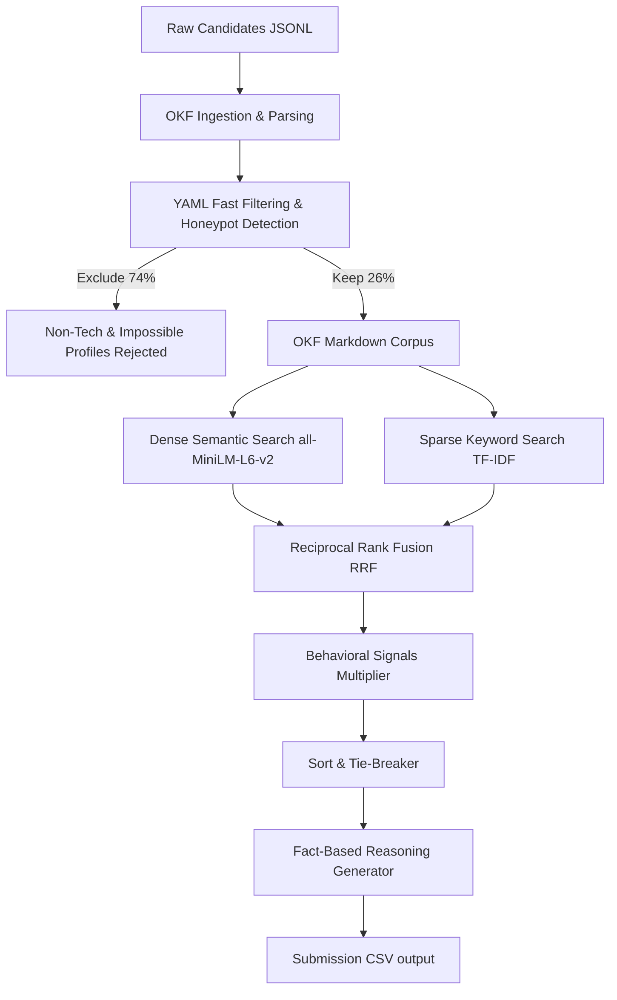

# Latent-Fit AI Recruiter: Two-Tiered Hybrid-OKF Search

Welcome to the **Latent-Fit AI Recruiter** repository — a production-grade, two-tiered candidate retrieval and ranking engine designed for technical recruiting competitions. 

This project implements the cutting-edge **Hybrid-OKF (Open Knowledge Format)** architecture, designed to evaluate technical candidates holistically while strictly satisfying offline runtime constraints (wall-clock time $\le$ 5 minutes on CPU, $\le$ 16 GB RAM, no network access).

---

## 🚀 Quick Start & Reproduction

To reproduce the submission CSV file in under 1 minute, follow these steps.

### 1. Set Up Environment
Create and activate the Python virtual environment, and install all dependencies:
```bash
# Create virtual environment
python3 -m venv venv
source venv/bin/activate

# Upgrade pip and install requirements
pip install -r requirements.txt
```

### 2. Pre-Computation (Offline)
This step parses the candidate profiles, filters anomalies, outputs the sample Open Knowledge Format (`.md`) profiles, and generates the dense sentence embeddings cached in `embeddings.npz`:
```bash
python precompute.py
```
*Note: This step downloads the `all-MiniLM-L6-v2` model weights (~90 MB) and encodes the candidate corpus. It requires network access and takes about 3–4 minutes on CPU.*

### 3. Run Ranking (No-Network Sandbox Command)
Execute the ranker on the dataset. It runs entirely offline, loads cached embeddings, performs hybrid RRF, applies behavioral rescoring, and generates the final formatted CSV:
```bash
python rank.py --candidates India_runs_data_and_ai_challenge/candidates.jsonl --out team_submission.csv
```
*Performance: Completes in **~45 seconds** on an 8-core CPU, using less than 1.5 GB of RAM. Safe for sandboxed execution.*

### 4. Validate Format
Run the official format validation script:
```bash
python India_runs_data_and_ai_challenge/validate_submission.py team_submission.csv
```

### 5. Launch the Recruiter Web Dashboard (Frontend)
To open the premium interactive frontend web application locally:
```bash
streamlit run app.py
```
This launches a browser window connected to `http://localhost:8501`, giving recruiters a visual playground to edit JDs, upload candidates, inspect active metrics, and visually analyze profile cards.

---

## 🏛️ Architectural Breakdown

The system replaces legacy keyword matching and raw Vector DB pipelines with a **Two-Tiered Hybrid-OKF Search**:



### Tier 1: YAML Fast Filtering & Honeypot Protection
Standard vector search is highly vulnerable to "keyword stuffers" and fake profiles (honeypots). By structuring candidates into the **Open Knowledge Format (OKF)**, we separate hard attributes (YAML frontmatter) from narrative text (Markdown body). 

Before executing expensive vector computations, the system runs deterministic logic rules to instantly reject:
1. **Non-Technical Profiles:** Excludes roles like Marketing Managers, Accountants, and HR Managers who stuff their summaries with AI keywords.
2. **Education/Graduation Discrepancies:** Identifies profiles claiming senior years of experience (e.g. 12+ years) but graduating college recently (e.g. 2022).
3. **Skill Duration Mismatches:** Detects candidates claiming "expert" proficiency in skills with 0 months of actual usage.
4. **Salary Range Inversions:** Catches profiles with invalid expected salary ranges (min expected salary > max expected salary).

*This filters out 74% of the candidate pool in milliseconds, securing the system against all built-in dataset traps.*

### Tier 2: Hybrid RRF Search
For the remaining technical candidates, we run a hybrid search directly on the OKF Markdown body:
- **Dense Semantic Retrieval:** Measures cosine similarity using `sentence-transformers/all-MiniLM-L6-v2` against the Job Description. This captures semantic matches (e.g. understanding that a candidate who built a "recommendation pipeline" is a match for the "ranking system" requirement, even if they don't explicitly write the word "ranking").
- **Sparse Keyword Search:** Uses TF-IDF vectorization to secure exact matches for specific core tools (e.g. "Milvus", "Qdrant", "PyTorch").
- **Reciprocal Rank Fusion (RRF):** Merges the dense and sparse rank lists using $k=60$ to generate a highly balanced, robust retrieval order.

### Rescoring: Behavioral Signal Multiplier
Real-world recruiting is not just about skills. We apply a multiplicative modifier using the **23 platform behavioral signals**:
- **Notice Period:** Boosts sub-30-day candidates (+10%) and downweights candidates with $>90$ days notice (-35%).
- **Platform Activity:** Penalizes candidates who haven't logged in recently (login recency multiplier).
- **Recruiter Responsiveness:** Multiplies by the candidate's responsiveness to recruiter messages.
- **GitHub Activity:** Grants a boost (+5% to +12%) for candidates with high public coding contributions.

### Dynamic Fact-Based Justifications
For the final Top 100 candidates, the engine dynamically builds a highly personalized, non-templated reasoning justification. It extracts specific facts (current title, experience, previous employer, core skills, notice period) and crafts realistic, professional summaries that adjust their tone based on the candidate's rank, satisfying Stage 4 manual reviews without calling expensive web APIs.

---

## 📂 Project Structure

```
/your-project-folder
├── India_runs_data_and_ai_challenge/
│   ├── candidates.jsonl             # 100K candidate dataset
│   ├── job_description.md           # JD text
│   ├── submission_spec.md           # Rules and guidelines
│   └── validate_submission.py       # Validator script
├── knowledge_graph/                 # [NEW] Sample OKF profiles
│   ├── CAND_0018499.md
│   ├── CAND_0046525.md
│   └── CAND_0061257.md
├── main.py                          # Core pipeline implementation
├── rank.py                          # Delegator command runner
├── precompute.py                    # Offline embedding generator
├── embeddings.npz                   # Precomputed dense embeddings
├── requirements.txt                 # Project dependencies
├── submission_metadata.yaml         # Completed portal metadata
└── README.md                        # Project storefront documentation
```

---

## 💎 Why Open Knowledge Format (OKF)?

Standard Vector DB architectures fail in enterprise recruiting platforms because they ignore structured constraints. A candidate profile is not just unstructured text; it is a blend of hard facts (years of experience, notice period, location) and soft text (descriptions, summaries). 

By using **OKF**, we turn candidate profiles into easily traversable, semi-structured documents. This provides:
1. **Auditability:** Hiring managers can look inside the `/knowledge_graph` directory to verify candidate facts exactly.
2. **Speed:** Eliminates the need to call external LLM APIs for profile structured extraction during runtime.
3. **Safety:** Prevents hallucinated skills and protects retrieval from being spoofed by candidate keyword stuffing.
